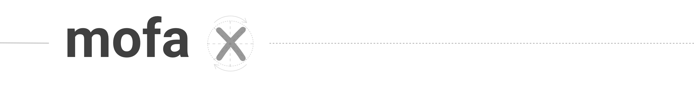
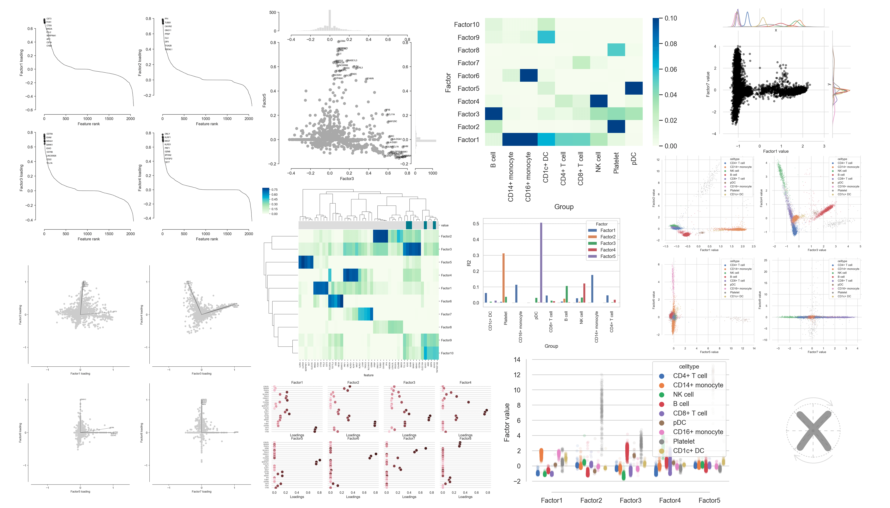

Work with trained factor models in Python.

This library provides convenience functions to load and visualize factor models trained with MOFA+ in Python. For more information on the multi-omics factor analysis v2 framework please see [this GitHub repository](https://github.com/bioFAM/MOFA2).

## Getting started

### Installation

```
pip install git+https://github.com/gtca/mofax
```

### Training a factor model

Please see the [MOFA+ GitHub repository](https://github.com/bioFAM/MOFA2) for more information on training the factor models with MOFA+.

### Loading the model

Import the module and create a connection to the HDF5 file with the trained model:

```python
import mofax as mfx

model = mfx.mofa_model("trained_mofaplus_model.hdf5")
```

The connection is created in the readonly mode by default and can be terminated by calling the `close()` method on the model object at the end of the working session:

```python
model.close()
```

#### Model object

Model object is an instance of a `mofa_model` class that wraps around the HDF5 connection and provides a simple way to address the parts of the trained model such as expectations for factors and for their loadings (weights) eliminating the need to traverse the HDF5 file manually.

#### Model methods

Simple data structures (e.g. lists or dictionaries) are typically returned upon calling the properties of the mofa model, e.g. `model.shape`:

```python
model.shape
# returns (10138, 1124)
#         cells^  ^features
```

More complex structures are typically returned when using methods such as `model.get_cells()` to get `cell -> group` assignment as a pandas.DataFrame while also providing the way to only get this information for specific groups or views of the model.

```python
model.get_cells().head()
# returns a pandas.DataFrame object:
# 	group	cell
# 0	T_CD4	AATCCTGCACATCGCC-1
# 1	T_CD4	AAGACGTGTGATGCCC-1
# 2	T_CD4	AAGGAGCGTCGGCATG-1
# 3	T_CD4	AATCCGTCACGAGACG-1
# 4	T_CD4	ACACCGAGGAGGTTGA-1
```

Use `model.metadata` to get the metadata table — it's a shorhand for `samples_metadata`, there's also `features_metadata` available. 

```python
model.metadata.head()
# returns a pandas.DataFrame object:
#                     group  n_genes
# sample
# AATCCTGCACATCGCC-1  T_CD4     1087
# AAGACGTGTGATGCCC-1  T_CD4     1836
# AAGGAGCGTCGGCATG-1  T_CD4     2216
# AATCCGTCACGAGACG-1  T_CD4     1615
# ACACCGAGGAGGTTGA-1  T_CD4     1800
```

To get expectations of W (weights) and Z (factors) matrices, use `get_weights()` and `get_factors()`, respectively. There's also a `df=True` option to get expectations as a Pandas data frame rather than a NumPy 2D array.

```python
model.get_factors(factors=range(3), df=True).head()
#                      Factor1   Factor2   Factor3
# AATCCTGCACATCGCC-1  0.012582 -0.093512 -0.011228
# AAGACGTGTGATGCCC-1  0.001091 -0.027217 -0.011331
# AAGGAGCGTCGGCATG-1 -0.015097  0.093493 -0.010593
# AATCCGTCACGAGACG-1 -0.046222  0.225920  0.010083
# ACACCGAGGAGGTTGA-1  0.011766 -0.055964 -0.011298
```

#### Utility functions

A few utility functions such as `calculate_factor_r2` to calculate the variance explained by a factor are provided as well.

#### Plotting functions

A few basic plots can be constructed with plotting functions provided such as `plot_factors` and `plot_weights`. They rely on and limited by plotting functionality of Seaborn.

Please [check the notebooks](notebooks/) for detailed examples. Some of the implemented plots are demonstrated below.



## Contributions

In case you work with MOFA+ models in Python, you might find `mofax` useful. Please consider contributing to this module by suggesting the missing functionality to be implemented [in the form of issues](https://github.com/gtca/mofax/issues) and in the form of [pull requests](https://github.com/gtca/mofax/pulls).
